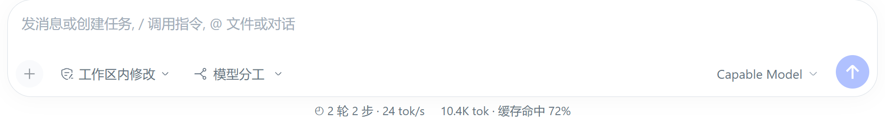
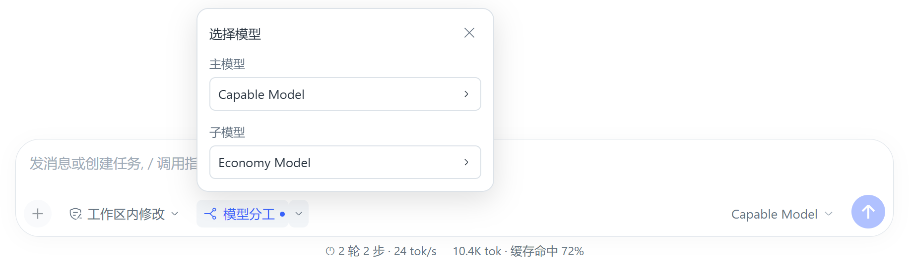
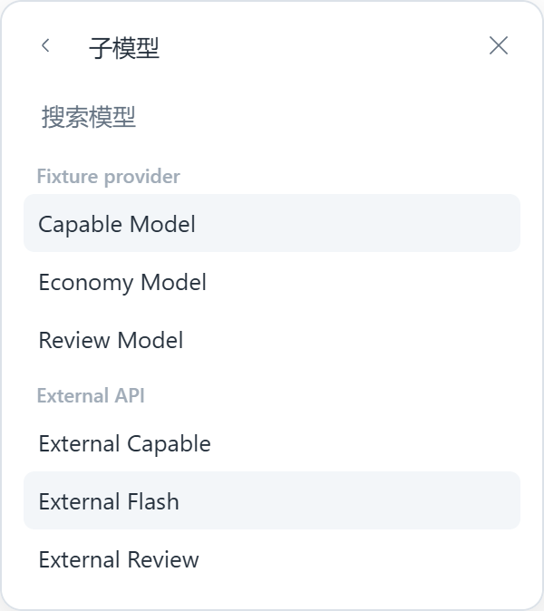
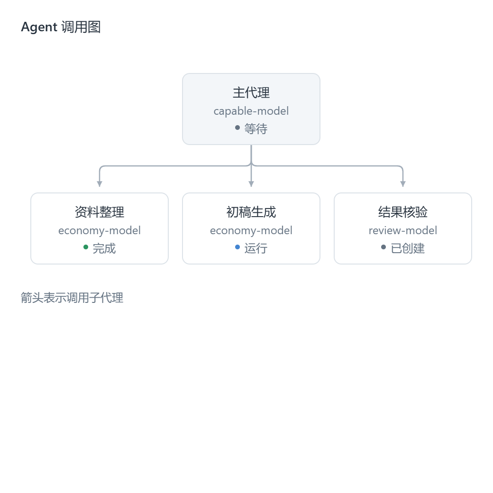

# DSH Agent Router

[中文说明](README.zh-CN.md) · [Download](https://github.com/yxccai/dsh-agent-router/releases/latest)

Let a capable main model plan and accept the work, while configurable lower-cost model roles handle bounded tasks. Inspect the real agents as boxes connected by arrows in DSH's existing right sidebar.

Click **Model delegation** in the chat input's toolbar to toggle it; use the adjacent arrow to choose main and worker models. Every new chat starts off; enabling it restores your last model pair, including after restart.









The composer screenshots render DSH's published native composer and model picker with the shipping plugin bundle and fixture provider, statistics and session services. The graph uses illustrative records. These are UI-test screenshots; the installed plugin reads actual DSH session records.

## Install

Requires **DeepSeek Harness Desktop 0.2.0-rc.2** with its native in-process spawn provider. This release targets that version; future DSH releases may require a plugin update.

1. Download **dsh-agent-router-0.2.2.tgz** from [Releases](https://github.com/yxccai/dsh-agent-router/releases/latest).
2. Open DSH → **Plugins** → install, and enter the absolute path to the downloaded archive.
3. Enable **dsh-agent-router**. If the new sidebar entry does not appear, restart DSH.
4. Click **Model delegation** inside the input. On first use, choose **Main / Worker** in the popover and click **Enable**. Later, the button toggles delegation directly; its adjacent arrow changes models.
5. Open **Agent graph** from the right-sidebar guide.

Alternatively install from GitHub using `https://github.com/yxccai/dsh-agent-router`. Built Host and client files are included, so users do not need a compiler. No npm registry publication is required.

To upgrade from 0.1.0, uninstall the old package through the plugin manager, install the new package and restart DSH. Version 0.1.0 omitted the configuration-page registration. Version 0.2.0 supplies the form in **Plugins → Installed → dsh-agent-router**, and through the component row's configure button. Keep a copy of existing model/role configuration before updating.

## Configure

Use DSH's existing provider configuration for API keys and endpoints. This plugin refers to provider/model IDs and stores no API keys. A provider must already be available in DSH; different API protocols need the appropriate DSH adapter.

The toolbar button is gray when off and blue with a status dot when enabled. Main/worker menus share the original right-side picker's native catalog, group models by provider and show search when there are more than four choices. Provider configuration changes refresh the catalog; one provider's failure leaves other models available. Choose a worker explicitly on first activation. Selected routes are added to the plugin settings with unknown prices. Edit prices, verification, fallback, tool restrictions and concurrency in **Plugins → Installed → dsh-agent-router**.

The switch belongs to the current chat. New chats always start off; explicitly enabled chats retain their state. Disabling preserves preferences and prevents new `team_delegate` invocations. Already-started delegations keep their settings snapshot. Ordinary model selection follows native DSH behavior after disabling, so DSH may retain the last actually used main model.

The following is the **config object**, not a complete profile patch. Replace the example provider and model IDs with the exact IDs supported by your adapter.

```yaml
models:
  - id: economy
    provider: your-provider-id
    model: your-economy-model-id
    maxTokens: 4096
    inputPrice: -1
    outputPrice: -1
    cacheReadPrice: -1
    cacheWritePrice: -1
  - id: capable
    provider: your-other-provider-id
    model: your-capable-model-id
    maxTokens: 8192
roles:
  - name: research
    modelId: economy
    fallbackModelId: capable
    verifierModelId: ""
    toolAllow: []
maxParallel: 3
qualityRetries: 1
maxOutputTokens: 8192
sessionBudget: 0
finalReviewReserve: 0
currency: USD
```

Roles and model routes are user-defined. When enabled, the chat controls select the actual main route and override each role's initial worker route. Role-specific verifier, fallback and tool restrictions retain their configured values. Without custom roles, an automatic `worker` role uses the selected worker and can escalate to the main model after failure; identical main/worker choices do not add an extra fallback attempt. `verifierModelId` optionally runs a separate, tool-free reviewer; leave it empty for main-agent acceptance without another paid call.

Model `reasoningEffort` is optional and must be supported by the chosen adapter. Prices are **per million tokens in one common currency**; `-1` means unknown, `0` means free. Prices can be omitted. They never select a provider automatically.

| Setting | Meaning |
|---|---|
| `modelId` / `fallbackModelId` | Role model reference (initial route overridden by chat worker choice) and optional escalation route |
| `verifierModelId` | Optional separate model reviewer; a passed review still needs main-agent acceptance |
| `toolAllow` | Nonempty array restricts child tools; empty inherits permitted tools except `team_delegate` |
| `qualityRetries` | Additional primary-model attempts after unsuccessful completion or review, 0–3 |
| `maxParallel` | Maximum active delegations across this plugin instance; excess work returns a capacity error |
| `maxDepth` | Native DSH delegation-depth limit; default 1 |
| `maxOutputTokens` | Per-request worker/reviewer output cap |
| `historyLimit` | Latest requests retained per agent; aggregate costs remain |
| `subagentProvider` | Native provider registry name; default `spawn` starts fresh context |
| `sessionBudget` / `finalReviewReserve` | Optional process-local estimate guard and funds reserved for main-agent calls |

The UI follows DSH's language and theme. Configuration changes affect new delegations; an already-started delegation keeps its role/model snapshot.

## Use

Enable **Model delegation** first. Try: “Use team_roles to inspect my roles. Plan the task yourself, delegate the source extraction to worker with clear acceptance criteria, then check the evidence and give the final answer.” Replace `worker` with your role name when using custom roles.

The plugin exposes two normal DSH tools:

- **team_roles** lists roles and prices.
- **team_delegate** receives `role`, `task`, `acceptance` and optional `context`. It uses a fresh child, awaits completion and disposal, and returns the result with actual worker/reviewer session IDs.

When delegation is off, both tools are hidden from that Agent's available tools and model context; new delegation attempts are also refused at runtime.

The main model decides when delegation is useful. Direct tools remain preferable for deterministic work. Native permissions still apply. Setup, authorization and disposal errors propagate; they do not silently trigger a different model.

Return value `accepted: null` means the main model must evaluate the result. `false` means all configured attempts failed. `true` means the optional reviewer passed it, and the main model still owns final acceptance. The plugin cannot guarantee equivalent quality to doing every step with the strongest model.

## Graph and costs

Each box represents a real session-backed Agent, including agents created by DSH's other native subagent tools. An arrow is actual parent-to-child lineage. Requests are nested in the box's details, never drawn as fake agents.

Click a box to view provider, model and estimated cost; expand **Requests** for individual calls. Long labels and model IDs are available in the details. Wide trees scroll horizontally without shrinking the text.

Costs use DSH's disjoint uncached input, cached input, cache-write and output buckets. Reasoning tokens are already included in output and are not charged twice. Missing prices or usage are shown as unknown, never silently zero. Changing prices re-estimates historical records; this release does not pin historical tariffs or fetch provider invoices.

Read [the model-neutral cost strategy](docs/strategy.md) and [implementation and limits](docs/architecture.md). The optional budget is an estimate guard, not a provider billing cap. It is disabled by default, requires all four prices and text-only requests, reserves concurrent work before dispatch, and preserves reservations when usage is unknown. Reservations cannot be restored after plugin/app restart: start a new conversation or disable the guard to continue an existing one. Auxiliary calls without a session ID are outside this guard.

## Development and validation

```sh
npm ci --ignore-scripts
npm run build
npm run check
npm test
npx playwright install chromium
npm run test:ui
npm pack
```

Node 22.19+ is required. Windows UI tests can use an existing Chrome installation. CI uses Playwright Chromium. `PLAYWRIGHT_CHROMIUM_EXECUTABLE_PATH` can select a local browser.

Keyless tests run real Cordis, the DSH agent loop, native tools, spawn, projections, the profile editor and Loader; the model/network boundary is scripted. Coverage includes default-off gating, actual main/worker request routes, persisted preferences, new chats, write conflicts, review failures, bounded escalation, cancellation, disposal, replay and budgets. Client service tests enforce Cordis dependencies and reproduce the previous undeclared-service catalog failure. Browser checks load the published native composer, model picker, directory service and built plugin against a real Host catalog builder, comparing both lists and checking cache reuse, search, configuration refresh, partial failures and retry. They also cover 916/520/320px light/dark layouts, toolbar/statistics separation, popover margins, Escape/outside dismissal, remembered pairs and rejected Host saves. Session state comes from test services; these checks do not use a user's running desktop session.

No paid provider API was exercised for this release. Contributions and [issues](https://github.com/yxccai/dsh-agent-router/issues) are welcome. Licensed under [MIT](LICENSE).
